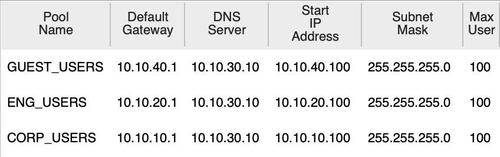
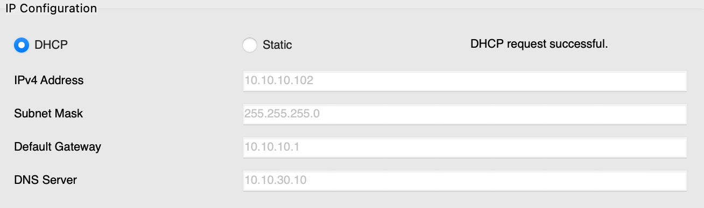
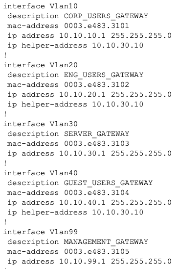
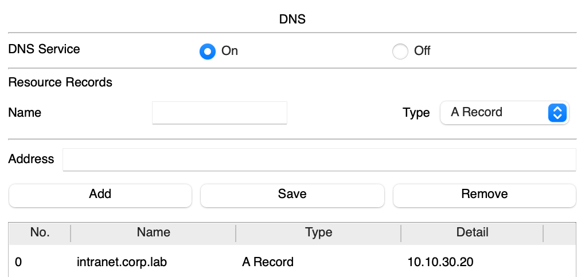
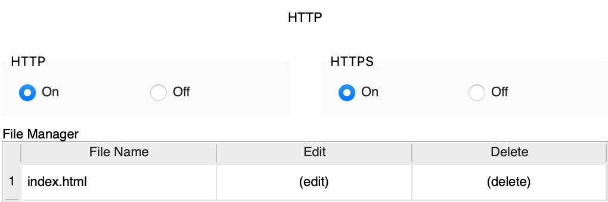
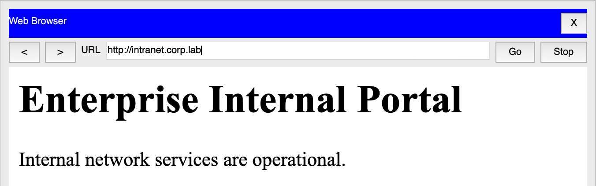
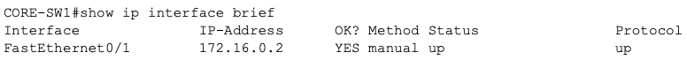
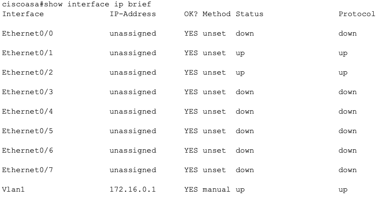
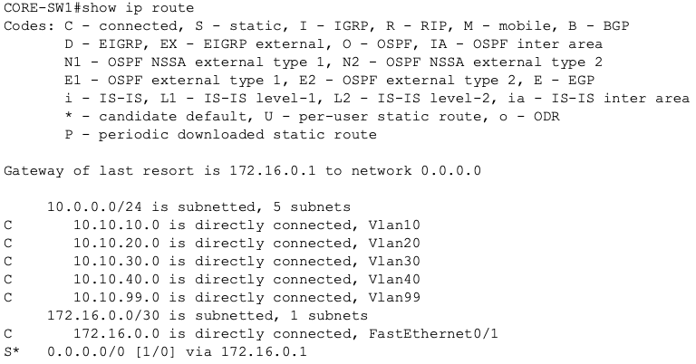
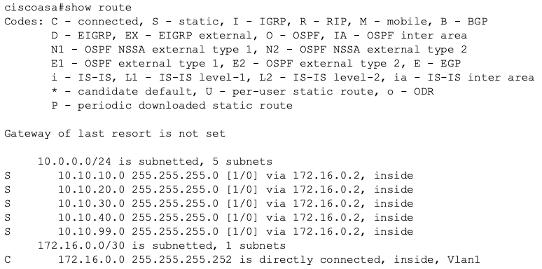

# Secure Enterprise Network Lab

## Overview

This project is an in-progress secure enterprise network lab built in **Cisco Packet Tracer**. The goal is to design, configure, secure, and test a small enterprise-style network while practicing networking and security concepts commonly used in real environments.

The lab is being built in phases so that each part of the network can be designed, implemented, verified, and documented before moving on.

## Current Status

**Completed through Phase 9: Core-to-Firewall Connectivity**

The network now includes:

- A complete enterprise-style physical topology
- A simulated ISP and external network
- A Cisco ASA firewall
- A Layer 3 core switch and two access switches
- Corporate, Engineering, Server, Guest, Management, and DMZ network segments
- A documented VLAN and IP addressing plan
- Static access-port assignments
- 802.1Q trunk links
- Layer 3 SVIs on `CORE-SW1`
- Inter-VLAN routing
- Centralized DHCP service
- DHCP relay between client VLANs and the infrastructure server
- Centralized DNS service
- An internal HTTP intranet server
- DNS-based access to the internal intranet using `intranet.corp.lab`
- A Layer 3 transit link between `CORE-SW1` and `ASA-FW1`
- A default route from the core toward the firewall
- Static ASA routes back to the internal VLANs

The internal network is functional and now has a routed path to the firewall. Internet access, NAT/PAT, DMZ publishing, guest isolation, management restrictions, switch hardening, and other security controls will be added in later phases.

---

## Network Topology


```text
                         PUBLIC-PC-01
                              |
                      Simulated Internet
                       198.51.100.0/24
                              |
                           ISP-R1
                              |
                       203.0.113.0/29
                              |
                           ASA-FW1
                          /       \
                         /         \
              172.16.0.0/30       DMZ
                       |       10.10.50.0/24
                       |             |
                   CORE-SW1      DMZ-WEB-01
                    /     \
                   /       \
          ACCESS-SW1       ACCESS-SW2
          /   |   \          /     \
       Corp  Eng  Servers  Admin   Guest
```

## VLAN and Subnet Design

| VLAN | Purpose | Subnet | Default Gateway |
|------|---------|--------|-----------------|
| 10 | Corporate Users | `10.10.10.0/24` | `10.10.10.1` |
| 20 | Engineering | `10.10.20.0/24` | `10.10.20.1` |
| 30 | Internal Servers | `10.10.30.0/24` | `10.10.30.1` |
| 40 | Guest Network | `10.10.40.0/24` | `10.10.40.1` |
| 50 | DMZ | `10.10.50.0/24` | `10.10.50.1` |
| 99 | Network Management | `10.10.99.0/24` | `10.10.99.1` |
| 999 | Parking / Unused Ports | None | None |

VLAN 50 belongs to the DMZ side of the design and is not carried across the internal access-switch trunks.

VLAN 999 is reserved for unused switch ports and will be used later during Layer 2 hardening.

## Addressing Strategy

Internal VLANs use the following pattern:

```text
10.10.<VLAN-ID>.0/24
```

The `.1` address is used as the default gateway for each routed internal VLAN.

| Address Range | Purpose |
|---------------|---------|
| `.1` | Default gateway |
| `.2 - .49` | Network infrastructure |
| `.50 - .99` | Servers / static devices |
| `.100 - .199` | DHCP clients |
| `.200 - .254` | Reserved for future use |

## Important Static Addresses

| Device / Interface | IP Address |
|--------------------|------------|
| VLAN 10 Gateway | `10.10.10.1` |
| VLAN 20 Gateway | `10.10.20.1` |
| VLAN 30 Gateway | `10.10.30.1` |
| VLAN 40 Gateway | `10.10.40.1` |
| ASA DMZ Interface | `10.10.50.1` |
| VLAN 99 Gateway | `10.10.99.1` |
| SRV-INFRA-01 | `10.10.30.10` |
| SRV-INTRANET-01 | `10.10.30.20` |
| SRV-DMZ-WEB-01 | `10.10.50.10` |
| PC-ADMIN-01 | `10.10.99.10` |
| ASA Inside Interface | `172.16.0.1` |
| CORE-SW1 Firewall Uplink | `172.16.0.2` |
| ISP-R1 WAN Interface | `203.0.113.1` |
| ASA Outside Interface | `203.0.113.2` |
| Reserved Public DMZ NAT Address | `203.0.113.3` |
| ISP Public-LAN Interface | `198.51.100.1` |
| PUBLIC-PC-01 | `198.51.100.10` |

## VLAN Configuration

The following VLANs have been created on `CORE-SW1`, `ACCESS-SW1`, and `ACCESS-SW2`:

```text
VLAN 10  CORP_USERS
VLAN 20  ENGINEERING
VLAN 30  SERVERS
VLAN 40  GUEST
VLAN 99  MANAGEMENT
VLAN 999 PARKING_LOT
```

Verification command:

```text
show vlan brief
```

## Access Port Assignments

### ACCESS-SW1

| Port | Connected Device | VLAN |
|------|------------------|------|
| Fa0/1 | CORE-SW1 | 802.1Q trunk |
| Fa0/2 | PC-CORP-01 | VLAN 10 |
| Fa0/3 | PC-CORP-02 | VLAN 10 |
| Fa0/4 | PC-ENG-01 | VLAN 20 |
| Fa0/5 | SRV-INFRA-01 | VLAN 30 |
| Fa0/6 | SRV-INTRANET-01 | VLAN 30 |

### ACCESS-SW2

| Port | Connected Device | VLAN |
|------|------------------|------|
| Fa0/1 | CORE-SW1 | 802.1Q trunk |
| Fa0/2 | PC-ADMIN-01 | VLAN 99 |
| Fa0/3 | PC-GUEST-01 | VLAN 40 |

## 802.1Q Trunking

The links between the access switches and `CORE-SW1` are configured as Layer 2 trunks.

### ACCESS-SW1 Trunk

Allowed VLANs:

```text
10,20,30,99
```

### ACCESS-SW2 Trunk

Allowed VLANs:

```text
40,99
```

Verification command:

```text
show interfaces trunk
```

Example evidence:


## Inter-VLAN Routing

`CORE-SW1` operates as a multilayer switch and performs Layer 3 routing between the internal VLANs.

Routing was enabled using:

```text
ip routing
```

The following SVIs act as VLAN default gateways:

```text
interface vlan 10
 ip address 10.10.10.1 255.255.255.0

interface vlan 20
 ip address 10.10.20.1 255.255.255.0

interface vlan 30
 ip address 10.10.30.1 255.255.255.0

interface vlan 40
 ip address 10.10.40.1 255.255.255.0

interface vlan 99
 ip address 10.10.99.1 255.255.255.0
```

Useful verification commands:

```text
show ip interface brief
show ip route
show ip arp
```

Example evidence:


## DHCP Service

`SRV-INFRA-01` provides centralized DHCP service from:

```text
10.10.30.10
```

DHCP pools were created for:

| Pool | Client Network | Gateway | Starting Address |
|------|----------------|---------|------------------|
| CORP_USERS | `10.10.10.0/24` | `10.10.10.1` | `10.10.10.100` |
| ENGINEERING | `10.10.20.0/24` | `10.10.20.1` | `10.10.20.100` |
| GUEST | `10.10.40.0/24` | `10.10.40.1` | `10.10.40.100` |

Each DHCP pool supplies:

```text
Subnet Mask: 255.255.255.0
DNS Server:  10.10.30.10
```

Corporate, Engineering, and Guest clients receive their IP configuration dynamically. Servers and the Management workstation remain statically addressed.

Example evidence:





## DHCP Relay

Because the DHCP server is located in VLAN 30 while clients are located in other VLANs, DHCP relay is configured on `CORE-SW1`.

```text
interface Vlan10
 ip helper-address 10.10.30.10

interface Vlan20
 ip helper-address 10.10.30.10

interface Vlan40
 ip helper-address 10.10.30.10
```

The relay allows client DHCP broadcasts to reach the centralized server across Layer 3 boundaries.

Example evidence:



## DNS Service

`SRV-INFRA-01` also provides internal DNS service at:

```text
10.10.30.10
```

An A record maps:

```text
intranet.corp.lab
```

to:

```text
10.10.30.20
```

This lets users access the internal web server by hostname instead of remembering its IP address.

Example evidence:



## Internal Intranet Web Service

`SRV-INTRANET-01` hosts the internal HTTP service.

```text
Server:  SRV-INTRANET-01
IP:      10.10.30.20
Gateway: 10.10.30.1
Service: HTTP
```

Clients can validate the service directly by IP:

```text
http://10.10.30.20
```

and then by DNS name:

```text
http://intranet.corp.lab
```

This verifies both Layer 3 connectivity and DNS name resolution.

Example evidence:





---

## Core-to-Firewall Transit Network

Phase 9 introduced a dedicated point-to-point Layer 3 transit network between `CORE-SW1` and `ASA-FW1`.

```text
CORE-SW1
172.16.0.2/30
     |
     | 172.16.0.0/30
     |
172.16.0.1/30
ASA-FW1
```

The `/30` subnet provides exactly two usable host addresses:

```text
172.16.0.0  Network
172.16.0.1  ASA-FW1
172.16.0.2  CORE-SW1
172.16.0.3  Broadcast
```

### CORE-SW1 Firewall Uplink

The physical switch port connected to `ASA-FW1` is configured as a Layer 3 routed port rather than a Layer 2 switchport.

```text
interface <CORE-ASA-PORT>
 description L3_TO_ASA-FW1
 no switchport
 ip address 172.16.0.2 255.255.255.252
 no shutdown
```

The `no switchport` command converts the interface into a routed Layer 3 interface.

Example evidence:



### ASA Inside Interface

The Packet Tracer ASA uses an ASA 5505-style switching model. The physical Ethernet port connected to `CORE-SW1` operates as a Layer 2 access port, while the Layer 3 address and firewall attributes are configured on a VLAN interface.

Logical inside interface:

```text
interface vlan 1
 nameif inside
 security-level 100
 ip address 172.16.0.1 255.255.255.252
 no shutdown
```

The physical ASA port connected to the core is assigned to VLAN 1:

```text
interface <ASA-CORE-PORT>
 switchport access vlan 1
 no shutdown
```

Conceptually:

```text
CORE-SW1
172.16.0.2
     |
     | Layer 3 transit
     |
ASA physical Ethernet port
     |
     | Layer 2 access port
     |
ASA Vlan1
172.16.0.1
nameif inside
security-level 100
```

Example evidence:



### CORE-SW1 Default Route

`CORE-SW1` now uses `ASA-FW1` as its gateway of last resort.

```text
ip route 0.0.0.0 0.0.0.0 172.16.0.1
```

Example routing-table entry:

```text
S* 0.0.0.0/0 via 172.16.0.1
```

Example evidence:



### ASA Routes to Internal VLANs

`ASA-FW1` requires return routes for internal subnets located behind `CORE-SW1`.

```text
route inside 10.10.10.0 255.255.255.0 172.16.0.2
route inside 10.10.20.0 255.255.255.0 172.16.0.2
route inside 10.10.30.0 255.255.255.0 172.16.0.2
route inside 10.10.40.0 255.255.255.0 172.16.0.2
route inside 10.10.99.0 255.255.255.0 172.16.0.2
```

VLAN 50 is not included because the DMZ will connect directly to the ASA in a later phase.

Example evidence:



### Phase 9 Routing Logic

Traffic leaving an internal client follows this hierarchy:

```text
PC-CORP-01
10.10.10.x
     |
     | Default gateway
     v
CORE-SW1
10.10.10.1
     |
     | Default route
     v
ASA-FW1
172.16.0.1
```

Return traffic from the ASA uses static routes pointing toward `172.16.0.2`, which is `CORE-SW1`.

At this stage, the core and firewall can route between each other, but Internet access is not expected yet because the ASA outside interface, ISP path, NAT/PAT, and final firewall policies are not complete.

## Current Validation

The following behaviors have been validated:

```text
Corporate -> Engineering          Working
Corporate -> Server VLAN          Working
Management -> Corporate           Working
Guest -> Internal Server          Working (intentionally unrestricted for now)

Corporate -> DHCP Server          Working
Engineering -> DHCP Server        Working
Guest -> DHCP Server              Working

Corporate DHCP assignment         Working
Engineering DHCP assignment       Working
Guest DHCP assignment             Working

DNS resolution:
intranet.corp.lab -> 10.10.30.20  Working

Internal HTTP access              Working
```

Guest access to internal services is currently allowed because security ACLs have not yet been applied. Later phases will restrict this behavior.

## Useful Verification Commands

```text
show vlan brief
show interfaces trunk
show interfaces <interface> switchport
show ip interface brief
show ip route
show ip arp
show running-config
show startup-config
```

## Design Decisions

- Separate VLANs and subnets are used to segment different types of enterprise traffic.
- `/24` subnets keep the addressing plan simple and predictable.
- `.1` is consistently used as the default gateway.
- Endpoints connect through Layer 2 access ports.
- Access switches provide local endpoint connectivity while `CORE-SW1` aggregates and routes traffic.
- 802.1Q trunks allow multiple VLANs to cross a single physical uplink.
- Trunks are restricted to only required VLANs.
- VLAN 99 crosses both trunks to support future infrastructure management.
- `CORE-SW1` provides centralized inter-VLAN routing using SVIs.
- DHCP is centralized on `SRV-INFRA-01`.
- DHCP relay allows one central server to serve clients in multiple VLANs.
- Servers and infrastructure devices remain statically addressed.
- DNS is centralized on `SRV-INFRA-01`.
- The intranet server is statically addressed so its DNS record remains predictable.
- The internal network is intentionally permissive before ACLs are introduced so later security controls can be tested against a known working baseline.

## Planned Security Features

Future phases will implement and validate:

- Core-to-firewall routing
- Cisco ASA security zones
- NAT and PAT
- DMZ access controls
- Guest VLAN isolation
- Access Control Lists (ACLs)
- Restricted management access
- SSH-only device administration
- Switch port security
- BPDU Guard
- Disabled unused switch ports
- Security test plans
- Packet Tracer Simulation Mode validation

## Project Structure

```text
secure-enterprise-network-lab/
|
├── README.md
├── configs/
├── docs/
│   └── ip-addressing.md
├── screenshots/
│   ├── topology.png
│   ├── access-sw1-vlan-verification.png
│   ├── access-sw2-vlan-verification.png
│   ├── trunk-verification.png
│   ├── svi-verification.png
│   ├── routing-verification.png
│   ├── inter-vlan-ping.png
│   ├── dhcp-pools.png
│   ├── dhcp-client-verification.png
│   ├── dhcp-relay-verification.png
│   ├── dns-record.png
│   ├── intranet-http-service.png
│   └── intranet-browser.png
└── topology/
    └── enterprise-network.pkt
```

## Tools and Technologies

- Cisco Packet Tracer
- Cisco IOS CLI
- Cisco ASA
- TCP/IP
- VLANs
- 802.1Q
- Inter-VLAN Routing
- DHCP
- DHCP Relay
- DNS
- HTTP
- Git
- GitHub

## Project Goals

1. Build a realistic enterprise-style network from the ground up
2. Practice Layer 2 switching and VLAN segmentation
3. Configure 802.1Q trunking
4. Implement Layer 3 inter-VLAN routing
5. Deploy centralized DHCP and DNS services
6. Configure internal application services
7. Apply least-privilege security controls
8. Test permitted and denied traffic flows
9. Practice structured network troubleshooting
10. Document technical decisions and validation results

## Progress

- [x] Phase 1 - Create project structure
- [x] Phase 2 - Build physical network topology
- [x] Phase 3 - Design IP addressing scheme
- [x] Phase 4 - Configure VLANs and access port assignments
- [x] Phase 5 - Configure 802.1Q trunk links
- [x] Phase 6 - Configure inter-VLAN routing
- [x] Phase 7 - Configure DHCP and DHCP relay
- [x] Phase 8 - Configure DNS and internal services
- [x] Phase 9 - Connect the core network to the firewall
- [ ] Phase 10 - Configure firewall zones
- [ ] Phase 11 - Configure NAT/PAT
- [ ] Phase 12 - Configure the DMZ
- [ ] Phase 13 - Isolate the guest network
- [ ] Phase 14 - Secure the management network
- [ ] Phase 15 - Configure switch port security
- [ ] Phase 16 - Harden unused switch ports
- [ ] Phase 17 - Create and execute a security test plan
- [ ] Phase 18 - Validate traffic using Packet Tracer Simulation Mode
- [ ] Phase 19 - Export and sanitize device configurations
- [ ] Phase 20 - Finalize topology documentation

## Repository Status

The enterprise topology, IP addressing plan, VLAN configuration, access-port assignments, trunk links, SVIs, inter-VLAN routing, DHCP, DHCP relay, DNS, internal HTTP services, and core-to-firewall transit routing are complete.

At this stage, the internal network provides centralized addressing and name-resolution services, routes between all internal VLANs, and has a functioning Layer 3 path to the ASA firewall. The next phases will configure firewall zones, outside connectivity, NAT/PAT, DMZ services, and progressively stricter security controls.
