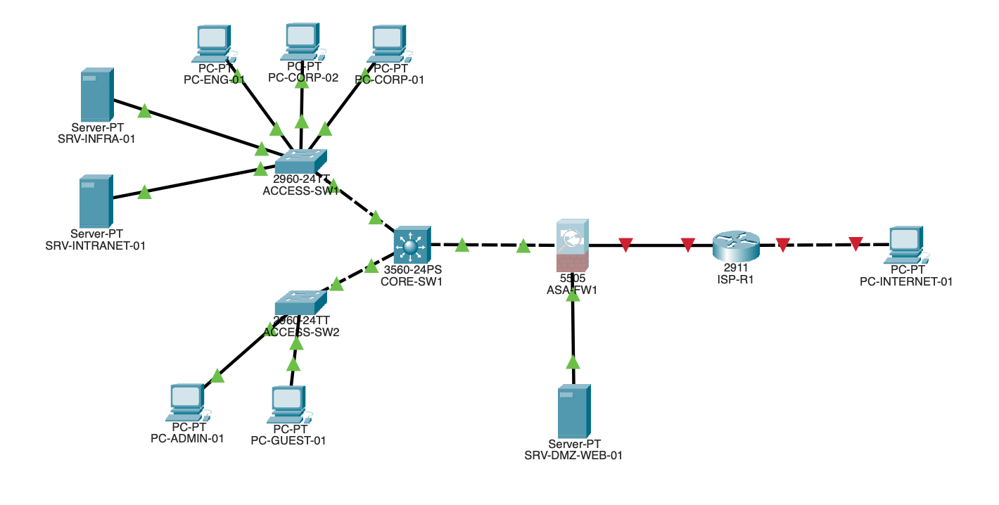
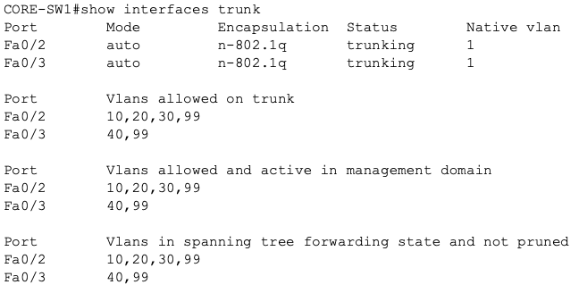
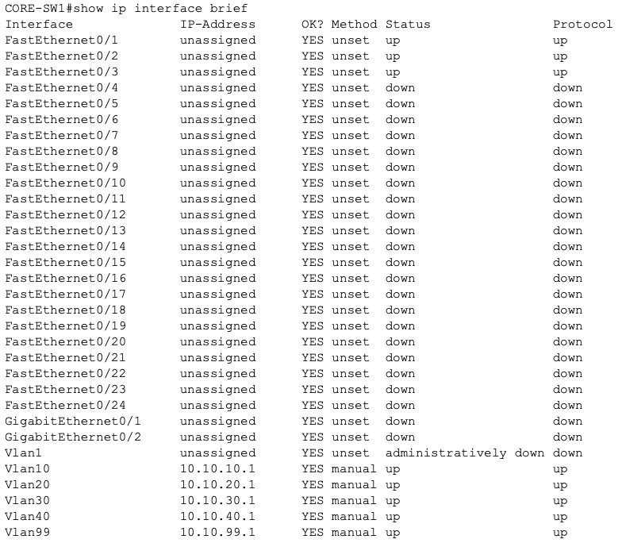
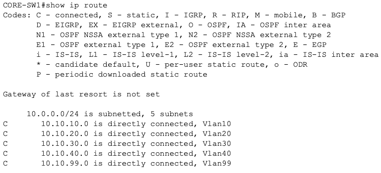

# Secure Enterprise Network Lab

## Overview

This project is an in-progress secure enterprise network lab built in **Cisco Packet Tracer**. The goal is to design, configure, secure, and test a small enterprise-style network while practicing core networking and security concepts.

The lab is being developed in phases so that each part of the network can be designed, implemented, verified, and documented before moving on.

## Current Status

**Completed through Phase 6: Inter-VLAN Routing**

The network now includes:

- A complete enterprise-style physical topology
- A simulated ISP and external network
- A Cisco ASA firewall
- A Layer 3 core switch
- Two Layer 2 access switches
- Corporate, Engineering, Server, Guest, Management, and DMZ segments
- A documented VLAN and IP addressing plan
- VLAN configuration across the switching infrastructure
- Static access-port assignments
- 802.1Q trunk links between the access switches and core
- Layer 3 SVIs on `CORE-SW1`
- Inter-VLAN routing between internal VLANs
- Static endpoint addressing for routing validation
- Successful connectivity tests between different VLANs

The network is currently functional but intentionally permissive. Security controls such as ACLs, firewall policies, NAT/PAT, guest isolation, and secure device management will be added in later phases.

---

## Network Topology



```text
                         PUBLIC-PC-01
                              |
                      Simulated Internet
                       198.51.100.0/24
                              |
                           ISP-R1
                              |
                       203.0.113.0/29
                              |
                           ASA-FW1
                          /       \
                         /         \
              172.16.0.0/30       DMZ
                       |       10.10.50.0/24
                       |             |
                   CORE-SW1      DMZ-WEB-01
                    /     \
                   /       \
          ACCESS-SW1       ACCESS-SW2
          /   |   \          /     \
       Corp  Eng  Servers  Admin   Guest
```

## VLAN and Subnet Design

| VLAN | Purpose | Subnet | Default Gateway |
|------|---------|--------|-----------------|
| 10 | Corporate Users | `10.10.10.0/24` | `10.10.10.1` |
| 20 | Engineering | `10.10.20.0/24` | `10.10.20.1` |
| 30 | Internal Servers | `10.10.30.0/24` | `10.10.30.1` |
| 40 | Guest Network | `10.10.40.0/24` | `10.10.40.1` |
| 50 | DMZ | `10.10.50.0/24` | `10.10.50.1` |
| 99 | Network Management | `10.10.99.0/24` | `10.10.99.1` |
| 999 | Parking / Unused Ports | None | None |

VLAN 50 belongs to the DMZ side of the design and is not carried through the internal access-switch trunks. VLAN 999 is reserved for unused switch ports and will be used later during Layer 2 hardening.

## Addressing Strategy

Internal VLANs follow a predictable addressing pattern:

```text
10.10.<VLAN-ID>.0/24
```

The `.1` address is used as the default gateway for each routed internal VLAN.

| Address Range | Purpose |
|---------------|---------|
| `.1` | Default gateway |
| `.2 - .49` | Network infrastructure |
| `.50 - .99` | Servers / static devices |
| `.100 - .199` | DHCP clients |
| `.200 - .254` | Reserved for future use |

## Important Static Addresses

| Device / Interface | IP Address |
|--------------------|------------|
| VLAN 10 Gateway | `10.10.10.1` |
| VLAN 20 Gateway | `10.10.20.1` |
| VLAN 30 Gateway | `10.10.30.1` |
| VLAN 40 Gateway | `10.10.40.1` |
| ASA DMZ Interface | `10.10.50.1` |
| VLAN 99 Gateway | `10.10.99.1` |
| SRV-INFRA-01 | `10.10.30.10` |
| SRV-INTRANET-01 | `10.10.30.20` |
| SRV-DMZ-WEB-01 | `10.10.50.10` |
| PC-ADMIN-01 | `10.10.99.10` |
| ASA Inside Interface | `172.16.0.1` |
| CORE-SW1 Firewall Uplink | `172.16.0.2` |
| ISP-R1 WAN Interface | `203.0.113.1` |
| ASA Outside Interface | `203.0.113.2` |
| Reserved Public DMZ NAT Address | `203.0.113.3` |
| ISP Public-LAN Interface | `198.51.100.1` |
| PUBLIC-PC-01 | `198.51.100.10` |

## VLAN Configuration

The following VLANs have been created on `CORE-SW1`, `ACCESS-SW1`, and `ACCESS-SW2`:

```text
VLAN 10  CORP_USERS
VLAN 20  ENGINEERING
VLAN 30  SERVERS
VLAN 40  GUEST
VLAN 99  MANAGEMENT
VLAN 999 PARKING_LOT
```

VLAN configuration was verified using:

```text
show vlan brief
```

## Access Port Assignments

### ACCESS-SW1

| Port | Connected Device | VLAN |
|------|------------------|------|
| Fa0/1 | CORE-SW1 | 802.1Q trunk |
| Fa0/2 | PC-CORP-01 | VLAN 10 |
| Fa0/3 | PC-CORP-02 | VLAN 10 |
| Fa0/4 | PC-ENG-01 | VLAN 20 |
| Fa0/5 | SRV-INFRA-01 | VLAN 30 |
| Fa0/6 | SRV-INTRANET-01 | VLAN 30 |

### ACCESS-SW2

| Port | Connected Device | VLAN |
|------|------------------|------|
| Fa0/1 | CORE-SW1 | 802.1Q trunk |
| Fa0/2 | PC-ADMIN-01 | VLAN 99 |
| Fa0/3 | PC-GUEST-01 | VLAN 40 |

End-device interfaces are configured as static access ports using:

```text
switchport mode access
switchport access vlan <VLAN-ID>
```

## 802.1Q Trunking

The uplinks between the access switches and `CORE-SW1` are configured as Layer 2 trunks.

### ACCESS-SW1 Trunk

Allowed VLANs:

```text
10,20,30,99
```

### ACCESS-SW2 Trunk

Allowed VLANs:

```text
40,99
```

The trunks are intentionally restricted to only the VLANs that need to cross each link.

Trunk operation can be verified using:

```text
show interfaces trunk
```

Example evidence:



## Inter-VLAN Routing

`CORE-SW1` is a multilayer switch and now performs Layer 3 routing between the internal VLANs.

IP routing was enabled with:

```text
ip routing
```

The following Switch Virtual Interfaces (SVIs) were configured:

```text
interface vlan 10
 ip address 10.10.10.1 255.255.255.0

interface vlan 20
 ip address 10.10.20.1 255.255.255.0

interface vlan 30
 ip address 10.10.30.1 255.255.255.0

interface vlan 40
 ip address 10.10.40.1 255.255.255.0

interface vlan 99
 ip address 10.10.99.1 255.255.255.0
```

Each SVI acts as the default gateway for its VLAN.

SVI status can be verified using:

```text
show ip interface brief
```

Example evidence:



## Routing Table

Because `CORE-SW1` has a Layer 3 interface in each internal VLAN, those networks appear as directly connected routes.

Verification command:

```text
show ip route
```

Expected connected networks include:

```text
10.10.10.0/24
10.10.20.0/24
10.10.30.0/24
10.10.40.0/24
10.10.99.0/24
```

Example evidence:



## Temporary Endpoint Addressing for Testing

Until DHCP is configured, internal endpoints use static addresses for routing validation.

| Device | IP Address | Default Gateway |
|--------|------------|-----------------|
| PC-CORP-01 | `10.10.10.100` | `10.10.10.1` |
| PC-CORP-02 | `10.10.10.101` | `10.10.10.1` |
| PC-ENG-01 | `10.10.20.100` | `10.10.20.1` |
| SRV-INFRA-01 | `10.10.30.10` | `10.10.30.1` |
| SRV-INTRANET-01 | `10.10.30.20` | `10.10.30.1` |
| PC-GUEST-01 | `10.10.40.100` | `10.10.40.1` |
| PC-ADMIN-01 | `10.10.99.10` | `10.10.99.1` |

The server and management addresses are intended to remain static. Corporate, Engineering, and Guest clients will later be moved to DHCP.

## Inter-VLAN Routing Validation

Routing was validated by testing connectivity between devices in different VLANs.

Example test paths include:

```text
Corporate -> Engineering
Corporate -> Servers
Management -> Corporate
Guest -> Internal Servers
```

The Guest VLAN can currently reach internal resources because no ACLs have been applied yet. This is intentional at this stage. Later security phases will restrict Guest traffic so it can reach permitted external resources without accessing protected internal networks.

Example evidence:


## Useful Verification Commands

```text
show vlan brief
show interfaces trunk
show interfaces <interface> switchport
show ip interface brief
show ip route
show ip arp
```

## Design Decisions

- Separate VLANs and subnets are used to segment different types of enterprise traffic.
- `/24` subnets keep the addressing plan simple and predictable.
- `.1` is consistently used as the default gateway address.
- End-user devices connect through Layer 2 access ports.
- Access switches provide endpoint connectivity while `CORE-SW1` aggregates the network.
- 802.1Q trunks allow multiple VLANs to cross one physical uplink.
- Each trunk is restricted to only the VLANs required on that access switch.
- VLAN 99 crosses both trunks so the Management network can eventually reach all infrastructure devices.
- `CORE-SW1` performs centralized inter-VLAN routing using SVIs.
- The DMZ is kept separate behind the ASA firewall.
- The network is intentionally permissive before ACLs are introduced so later security controls can be tested against a known working baseline.

## Planned Security Features

Future phases will implement and validate:

- DHCP and DHCP relay
- DNS and internal services
- Core-to-firewall routing
- Cisco ASA security zones
- NAT and PAT
- DMZ access controls
- Guest VLAN isolation
- Access Control Lists (ACLs)
- Restricted management access
- SSH-only device administration
- Switch port security
- BPDU Guard
- Disabled unused switch ports
- Security test plans
- Packet Tracer Simulation Mode validation

## Project Structure

```text
secure-enterprise-network-lab/
|
├── README.md
├── configs/
├── docs/
│   └── ip-addressing.md
├── screenshots/
│   ├── topology.png
│   ├── access-sw1-vlan-verification.png
│   ├── access-sw2-vlan-verification.png
│   ├── trunk-verification.png
│   ├── svi-verification.png
│   ├── routing-verification.png
│   └── inter-vlan-ping.png
└── topology/
    └── enterprise-network.pkt
```

## Tools

- Cisco Packet Tracer
- Cisco IOS CLI
- Cisco ASA
- TCP/IP
- 802.1Q
- Git
- GitHub

## Project Goals

1. Build a realistic enterprise-style network from the ground up
2. Practice Layer 2 switching and VLAN segmentation
3. Configure 802.1Q trunking
4. Implement Layer 3 inter-VLAN routing
5. Configure centralized network services
6. Apply least-privilege security controls
7. Test permitted and denied traffic flows
8. Practice structured network troubleshooting
9. Document technical decisions and validation results

## Progress

- [x] Phase 1 - Create project structure
- [x] Phase 2 - Build physical network topology
- [x] Phase 3 - Design IP addressing scheme
- [x] Phase 4 - Configure VLANs and access port assignments
- [x] Phase 5 - Configure 802.1Q trunk links
- [x] Phase 6 - Configure inter-VLAN routing
- [ ] Phase 7 - Configure DHCP
- [ ] Phase 8 - Configure DNS and internal services
- [ ] Phase 9 - Connect the core network to the firewall
- [ ] Phase 10 - Configure firewall zones
- [ ] Phase 11 - Configure NAT/PAT
- [ ] Phase 12 - Configure the DMZ
- [ ] Phase 13 - Isolate the guest network
- [ ] Phase 14 - Secure the management network
- [ ] Phase 15 - Configure switch port security
- [ ] Phase 16 - Harden unused switch ports
- [ ] Phase 17 - Create and execute a security test plan
- [ ] Phase 18 - Validate traffic using Packet Tracer Simulation Mode
- [ ] Phase 19 - Export and sanitize device configurations
- [ ] Phase 20 - Finalize topology documentation

## Repository Status

The enterprise topology, IP addressing plan, VLAN configuration, access-port assignments, trunk links, SVIs, and inter-VLAN routing are complete.

At this stage, the internal network is fully routed but intentionally permissive. The next phases will add centralized services and progressively apply security controls to turn the working network into a secured enterprise environment.
